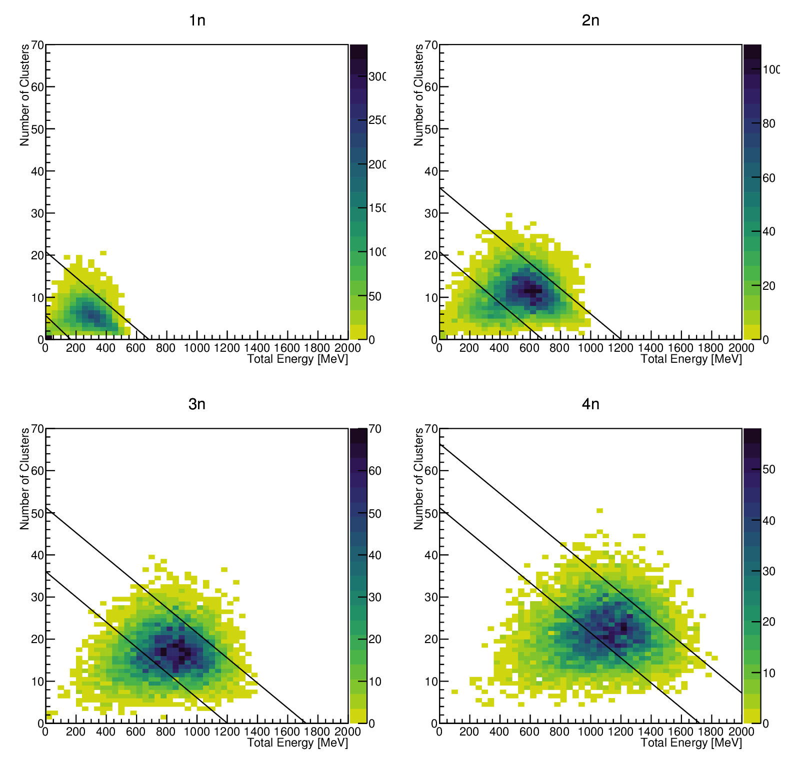

# Nveto_seg module for r3broot

## Changelog

Only major change listed. See commit messages for detailed information.

@40888c5 Massive overhaul of most classes, new clustering and event reconstruction. Will break some existing simulated / processed data. Also, interfaces of data storage classes have changed, requiring changes to, e.g., custom analysis scripts. Please simply rerun everything.

@a53f685 Geometry overhaul

@94441ec Nveto_seg Detector class, digitizer updates

@da55a13 Digitizer updates

@cee744f New Nveto_segDigitizer and Digitization Engine


## Components
Note that in contrast to the old Nveto_seg and VETO_SEG code in the /veto_seg/ directory, the spelling in e.g. class names is "Nveto_seg", with a small "l".


### Detectors

- [`R3BNveto_seg`](#detector-class) Main detector including light generation -> Nveto_segPoints


### Tasks

These tasks are derived from FairTask and used in the steering macros.

- `R3BNveto_segMCMon`: Control histograms for MonteCarlo data (Nveto_segPoints)
- [`R3BNveto_segDigitizer`](#digitizing): Detector response, Nveto_segPoints -> Nveto_segDigis
- `R3BNveto_segDigiMon`: Control histograms for digitized data (Nveto_segDigis)
- [`R3BNveto_segClusterFinder`](#clustering): Clustering of digitized data, Nveto_segDigis -> Nveto_segClusters
- `R3BNveto_segClusterMon`: ControlHistograms for clusters (Nveto_segClusters)
- [`R3BNveto_segNeutronReconstruction`](#event-reconstruction): Determination of Neutron first interaction points, Nveto_segClusters -> Nveto_segNeutrons
- `R3BNveto_segNeutronReconstructionEvaluation`: Comparison of reconstructed with actual neutron interaction points.


### Engines

For separation of the actual physics/business logic from the IO-managing tasks.

- `Nveto_seg::Digitizin_segEngine`
- [`Nveto_seg::NvetoClustringEngine`](#implementation-of-the-handshake-chain-clustering)


### Data Storage

Note that the classes indented for storing data (derived from TObject for usage with TClonesArray) are located in `r3bdata/Nveto_segData`. 

- `R3BNveto_segPoint`: Basic MonteCarlo energy depositions and light yield, see, [Detector Class](#detector-class)
- `R3BNveto_segDigi`: Combined Nveto_segPoints, digitized with detector response, see [Digitizin_seg](#digitizing). Also indented for mapped and calibrated experimental data.
- `R3BNveto_segCluster`: Clusters consisting out of Nveto_segDigis that belong together according to clustering conditions, see [Clustering](#clustering)
- `R3BNveto_segNeutron`: Position, Energy and Time information for neutron interactions found by event reconstruction processes


### Configuration Storage

- `R3BNveto_segGeoPar`: The complete Nveto_seg GeoNode used in the Simulation
- `R3BNveto_segNeutron2DPar`: Cuts used for the [2D Method](#the-2d-method-for-neutron-multiplicity-determination) to determine neutron multiplicities.


### Auxiliary Classes

- `R3BNveto_segContFact`: Container Factory for the configuration storage classes (pure boilerplate)
- `R3BNveto_segVisualizer`: 3D display of events, prepared by the `-Mon` tasks. (Work in progress)
- [`Nveto_seg::Neutron2DCalibr`](#calibration): Calibration of cuts for the 2D neutron multiplicity method


## Detector Class

`R3BNveto_seg` is the main class derived from `R3BDetector` for use in simulations. Note that it does not include the geometry itself, but takes `Nveto_seg_v2_` geometry files from `/geometry/`. Suitable geometry files require proper naming of the active volume and copy numbers. See [Geometry](#geometry)

It fills to main outputs for each simulated event:
- Nveto_segPoints (`R3BNveto_segPoint`), each representing energy deposition and light yield of a track in a paddle.
- Nveto_segPrimaryNeutronInteractionPoints (`FairMCPoint`), each representing the first interaction points of primary neutrons for later comparison to the reconstructed neutrons.

Control histograms are extracted to `R3BNveto_segMCMon`.


## Digitizin_seg

The Digitizin_seg task `R3BNveto_segDigitizer` handles the Input and Output of data while invoking the `Nveto_seg::Digitizin_segEngine` for the actual processing. The Digitizin_seg Engine is independent of any (Fair-/R3B-)Root class except the random number generator and can be reused in other projects if necessary.

The task takes the TClonesArray Nveto_segPoints(`R3BNveto_segPoint`) and fills TClonesArray Nveto_segDigis(`R3BNveto_segDigi`). In addition the configuration storage `Nveto_segGeoPar`

The digitizing engine is awaiting further changes reflecting changes in the Nveto_seg electronics. (Work in Progress)

In addition, some control histograms are created, while most control histograms are extracted to `R3BNveto_segDigiMon`.


## Clustering

Clustering is the process of grouping Objects together by a specified condition. 

The task `R3BNveto_segClusterFinder` uses the  implementation in `Nveto_seg::NvetoClustringEngine` of what can be called *handshake-chain clustering*, were a cluster is finished if all of the Digis in it have no neighbor that is not in the cluster.

The task takes the TClonesArray Nveto_segDigis(`R3BNveto_segDigi`) and fills TClonesArray Nveto_segClusters(`R3BNveto_segCluster`).

Control histograms are located  to `R3BNveto_segClusterMon`.


### Implementation of the handshake-chain clustering

The implementation is a template, thus any type of object can be clustered together.
For this example, integers are used. Starting point is an unsorted vector of integers and the clustering condition is a difference of 1 or less. For the clustering process, several iterators referencing certain points in the vector are needed:

- The *begin* of the current part of the vector to look at
- A *moving_divider* that separates the clustered part from the rest of the unclustered part
- The fixed *end* of the vector
- And the iterator to the object currently looked at, here called *a*

```C++
Tit moving_partition(const Tit begin, Tit moving_divider, const Tit end) const
{
	for (Tit a = begin; a != moving_divider; a++)
	{
		moving_divider = std::partition(moving_divider, end, [&](const T& b) {return f(*a, b);});
	}
    return moving_divider;
}
```

In the beginning, the vector is completely unclustered and a new cluster is started with the first element:

	{ 28, 13, 23, 22, 15, 16, 3, 6, 4, 26, 10, 11, 19, 8, 29, 12, 25, 30, 17, 18, 24 }
	   │   │                                                                         │
	   │   └ moving_divider                                                          └ end
	   └ begin, a

Now, each object from the moving_divider to the end is compared with *a*, which currently is the first element, and if the clustering condition is fulfilled, moved next to it. This is done by std::partition. Now the *moving_divider* is set to the end of this partitioned part, and the next element between the current *a* and the *moving_divider* becomes the new *a*, which the unclustered part is compared to:

	{ 28, 29, 30, 22, 15, 16, 3, 6, 4, 26, 10, 11, 19, 8, 23, 12, 25, 13, 17, 18, 24 }
	   │   │       │                                                                 │
	   │   a       └ moving_divider                                                  └ end
	   └ begin

This continues until the *moving_divider* is reached, at this point the cluster is finished and extracted, and a new cluster is started:

	{ xx, xx, xx, 22, 15, 16, 3, 6, 4, 26, 10, 11, 19, 8, 23, 12, 25, 13, 17, 18, 24 }
	               │   │                                                             │
	               │   └ moving_divider                                              └ end
	               └ begin, a

Note that the *moving_divider* does move every time std::partition adds new objects to the cluster, thus also these times are iterated over:


	{ xx, xx, xx, 22, 23, 16, 3, 6, 4, 26, 10, 11, 19, 8, 15, 12, 25, 13, 17, 18, 24 }
	               │   │   │                                                         │
	               │   a   └ moving_divider                                          └ end
	               └ begin
	{ xx, xx, xx, 22, 23, 24, 3, 6, 4, 26, 10, 11, 19, 8, 15, 12, 25, 13, 17, 18, 16 }
	               │       │  │                                                      │
	               │       a  └ moving_divider                                       └ end
	               └ begin
	{ xx, xx, xx, 22, 23, 24, 25, 6, 4, 26, 10, 11, 19, 8, 15, 12, 3, 13, 17, 18, 16 }
	               │           │  │                                                  │
	               │           a  └ moving_divider                                   └ end
	               └ begin

Note that for this process, the order of the objects is irrelevant. The algorithm will always find all elements that belong together.

In this example, the result is:

	{ 28, 29, 30 }, { 22, 23, 24, 25, 26 }, { 4, 3 }, { 10, 11, 12, 13 }, { 8 }, { 19, 18, 17, 16, 15 }, { 6 }


## The 2D-method for neutron multiplicity determination

It was found that plotting the number of clusters vs the total energy is an acceptable way of determining the neutron multiplicities, at least for large numbers of planes.


### Calibration

This method needs to be calibrated. In this process, the cuts applied to the 2D histogram need to be created and adjusted such that the "best" result is obtained. This is handled by the `Nveto_seg::Neutron2DCalibr` class, which is not a task as specifically set inputs are needed (events have different numbers of primary neutrons). Cuts created by this process are stored in `R3BNveto_segNeutron2DPar`.



At this point, efficiency matrices can already be created for the calibration dataset, e.g.:

| 600 MeV |  1n       |  2n       |  3n       |  4n       |
|--------:|-----------|-----------|-----------|-----------|
| **0n**  |  0.06     |  0        |  0        |  0        |
| **1n**  |  **0.90** |  0.16     |  0.01     |  0        |
| **2n**  |  0.04     |  **0.76** |  0.23     |  0.04     |
| **3n**  |  0        |  0.07     |  **0.68** |  0.32     |
| **4n**  |  0        |  0        |  0.08     |  **0.56** |

With the number of generated neutrons on the columns and the detected neutron multiplicity in the rows. Note that in this example, the chance to detect no neutron whatsoever is only 6% in the case of one incident neutron. In any other case, the total detection efficiency is 100%.

The cuts are saved in the parameter file via `R3BNveto_segNeutron2DPar`. Provided with the total energy and number of clusters, this class then can return the neutron multiplicity.


### Event Reconstruction

Provided with the neutron multiplicity parameter *nN*, the task `R3BNveto_segNeutronReconstruction` can try to find the neutron interaction points from the TClonesArray Nveto_segClusters (`R3BNveto_segCluster`). This is currently done by sorting the clusters by time, taking the *nN* first, and using these clusters' first digi position. These positions are then saved to the TClonesArray Nveto_segNeutrons (`R3BNveto_segNeutron`).

Work in Progress

### Reconstruction Evaluation 

Work in Progress

